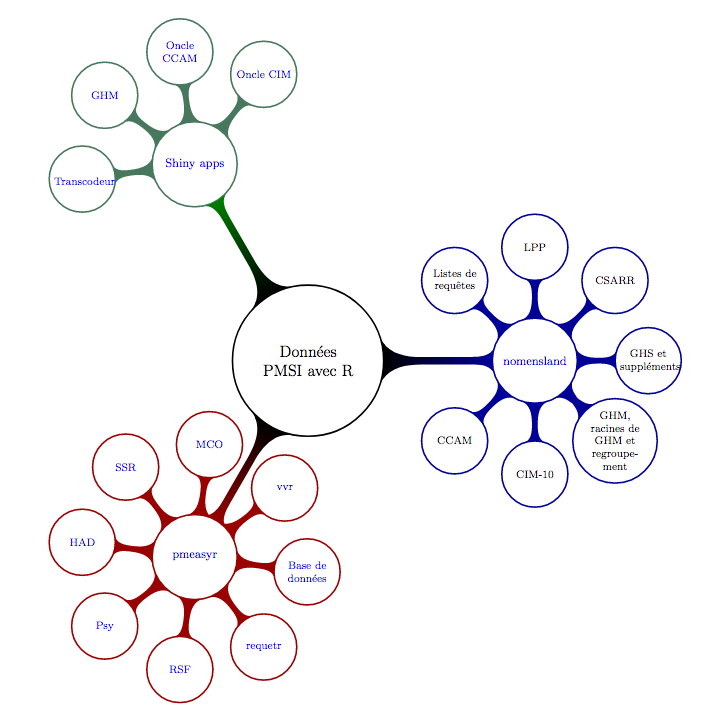
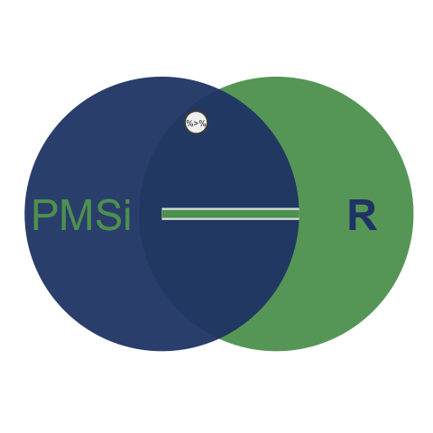

```{r setup, include=FALSE}
options(htmltools.dir.version = FALSE)
```


```{r echo = FALSE}
dtttable <- function(x, n = 12) DT::datatable(x, extensions = 'Buttons', options = list(
      #pageLength = nrow(df2()),
      pageLength = n,
      dom = 'Bfrtip',
      buttons = c('copy', 'csv', 'excel', 'colvis')), rownames = F)
```


class: inverse, center, middle


---


class: inverse, center, middle

# Introduction

---

# PMSI `%>%` R

### PMSI

#### `MCO` - `SSR` - `RSF-ACE` - `Psy`

#### `CCAM` - `CIM-10` - `GHM` - `GHS` - `CSARR` - `...`

### R

#### `dplyr & tidyverse` - `magrittr` - `devtools` - `rmarkdown`

---

# Données PMSI avec R

<!-- - pmeasyr -->
<!-- - requetr, api -->
<!-- - nomensland -->
<!-- - Oncles CIM et CCAM -->

<a href = "mind_map.pdf"></a>

---

# Liens utiles


- [blog pmeasyr](https://guillaumepressiat.github.io/)
- [aide pmeasyr](https://guillaumepressiat.github.io/miscellany/aides_pmeasyr/)
- [Partage de méthodes PMSI](http://toudim.netlify.com/)
- [nomensland : référentiels et méthodes](https://guillaumepressiat.github.io/nomensland)


---
class: inverse, center, middle

# Objectif de la matinée

*Mettre en forme un document utilisant les notebook et `pmeasyr`.*

---


class: inverse, center, middle

## Première partie : `pmeasyr` <br> import de données et exemples de requêtes


--- 
*a. Installation des packages, import MCO, requêtes de base et une requête sur une ligne du recours exceptionnel, "sur le SSR c’est la même chose"*<br>
*b. Stockage dans une base (monetdb par exemple), requêtes pour exemple,<br> import RSF-ACE pour réaliser chaînage MCO – ACE (ATU)*

```{r eval = FALSE}
# Bascule dans RStudio
# voir script
partie1.R
```

---

# Installer R et RStudio

Pour installer R, cliquer sur les liens pour effectuer l'installation qui correspond à votre plateforme, puis installer RStudio : 
- [R Windows](https://cran.r-project.org/bin/windows/base/), [R Mac](https://cran.r-project.org/bin/macosx/), [R Linux](https://www.digitalocean.com/community/tutorials/how-to-install-r-on-ubuntu-16-04-2)
- [RStudio Desktop](https://www.rstudio.com/products/rstudio/download/#download)

---

## Installation des packages nécessaires

```{r eval = FALSE}
install.packages('tidyverse');  install.packages('sqldf'); install.packages('MonetDBLite')
install.packages('sjlabelled'); install.packages('DBI');   install.packages('jsonlite')
install.packages('devtools')
```

Une fois que `tidyverse` est installé, lancer :

```{r eval = FALSE}
devtools::install_github('IM-APHP/pmeasyr')
devtools::install_github('GuillaumePressiat/nomensland')
```

Pour utiliser l'API de l'AP-HP depuis R : 

```{r eval = FALSE}
devtools::install_git('http://164.1.196.52:8086/4073189/requetr.git')
```

[Lien vers l'API](http://164.1.196.52:8000/public/accueil.html)

---

## Mémo de la partie 1a

### Données

- Voir l'[arborescence des archives](https://guillaumepressiat.github.io/pmeasyr/archives.html#arborescence-des-archives) choisie
- Lien vers l'[intranet du DIM Siège](dime.aphp.fr)

### Fonctions

- Dézippage archives ministérielles : [adezip](https://im-aphp.github.io/pmeasyr/reference/adezip.html)
- Dézippage archives intranet : [adezip3](https://im-aphp.github.io/pmeasyr/reference/adezip3.html)
- Import : [irsa](https://im-aphp.github.io/pmeasyr/reference/irsa.html), [iano_mco](https://im-aphp.github.io/pmeasyr/reference/iano_mco.html), [itra](https://im-aphp.github.io/pmeasyr/reference/itra.html), [irha](https://im-aphp.github.io/pmeasyr/reference/irha.html)
- Requête : [requete](https://im-aphp.github.io/pmeasyr/reference/requete.html), [requete_db](https://im-aphp.github.io/pmeasyr/reference/requete_db.html)

---


## Mémo de la partie 1b

### Fonctions

En plus de la partie 1a : 

- Import : [irafael](https://im-aphp.github.io/pmeasyr/reference/irafael.html)
- Base de données [db_mco_out](https://im-aphp.github.io/pmeasyr/reference/db_mco_out.html), [db_rsf_out](https://im-aphp.github.io/pmeasyr/reference/db_rsf_out.html), [tbl_mco](https://im-aphp.github.io/pmeasyr/reference/tbl_mco.html), [tbl_rsf](https://im-aphp.github.io/pmeasyr/reference/tbl_rsf.html)

---

class: inverse, center, middle

## Deuxième partie : cas pratiques, avec rmarkdown / rmdformats

--- 
*a. Installer les librairies pour rmarkdown (dont rmdformats)*<br>
*b. Création d’un rmarkdown (du fichier vide au document final)*<br>
*c. Mobilisation de l'API CCAM / CIM*<br>


---

## a. Installer les librairies

```{r eval = FALSE}
install.packages('rmarkdown')
devtools::install_github('GuillaumePressiat/rmdformats')
```

## b. & c. 

```{r eval = FALSE}
# Bascule dans RStudio
# L'objectif est de créer le notebook
partie2.Rmd / partie2.html
# et de se familiariser avec l'API
```


---


## Mémo de la partie 2

### Fonctions

- api ap-hp: lien vers [requetr](http://164.1.196.52:8086/4073189/requetr.git), le package pour interfacer avec l'API, lien vers le site de l'[API](http://164.1.196.52:8000/accueil/public.html)
- nomensland : [get_table](https://guillaumepressiat.github.io/nomensland/reference/get_table.html),
[get_liste](https://guillaumepressiat.github.io/nomensland/reference/get_liste.html)


---

class: inverse, center, middle

# jupyter

--- 
*refaire les mêmes cas pratiques au sein d'un notebook [jupyter](http://jupyter.org/)*

---

## Installer jupyter et un noyau R

- Jupyter : http://jupyter.org/install
- R kernel : https://irkernel.github.io/installation/


---

# D'autres exemples

- Calculer un IP 
- Valoriser des rsa
- Travailler à l'échelle GH (rsa par GH, chainage intra-GH)


---

class: inverse, center, middle




Merci de votre participation.

